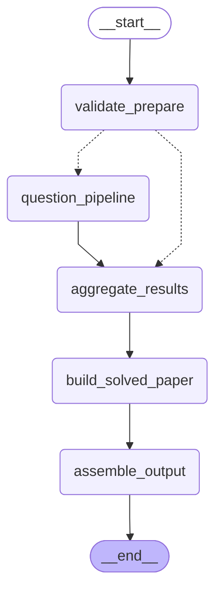
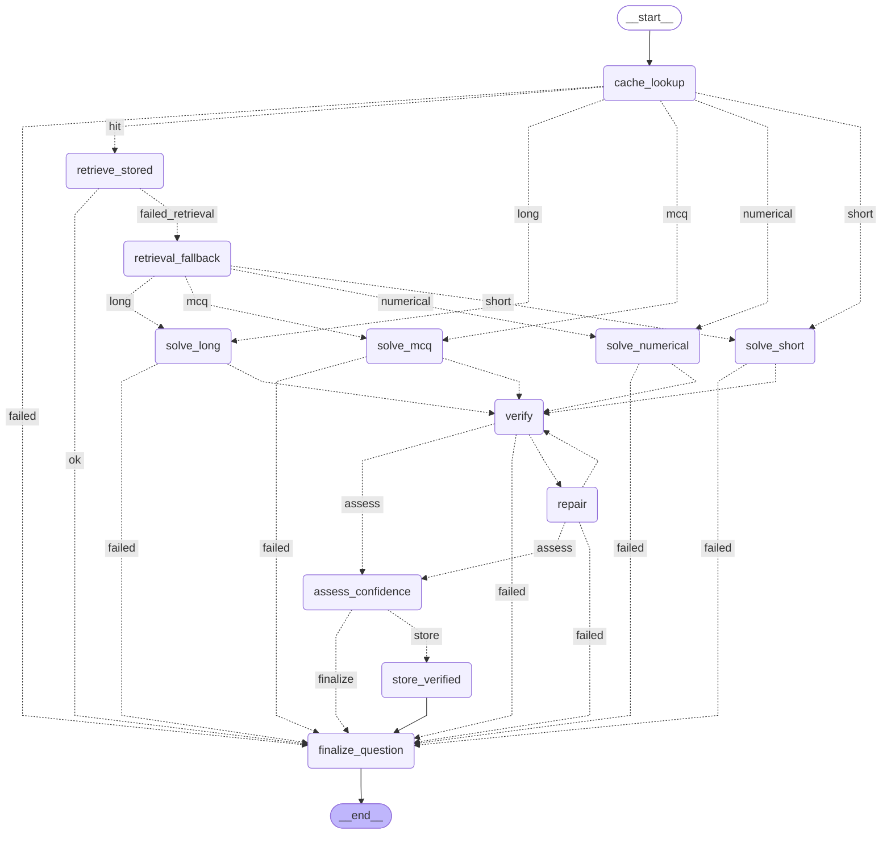

# Compiled graphs (generated by `python -m app.workflow.visualize`)

## Paper graph

```mermaid
---
config:
  flowchart:
    curve: linear
---
graph TD;
	__start__([<p>__start__</p>]):::first
	validate_prepare(validate_prepare)
	question_pipeline(question_pipeline)
	aggregate_results(aggregate_results)
	build_solved_paper(build_solved_paper)
	assemble_output(assemble_output)
	__end__([<p>__end__</p>]):::last
	__start__ --> validate_prepare;
	aggregate_results --> build_solved_paper;
	build_solved_paper --> assemble_output;
	question_pipeline --> aggregate_results;
	validate_prepare -.-> aggregate_results;
	validate_prepare -.-> question_pipeline;
	assemble_output --> __end__;
	classDef default fill:#f2f0ff,line-height:1.2
	classDef first fill-opacity:0
	classDef last fill:#bfb6fc

```

## Per-question graph (the `question_pipeline` node)

```mermaid
---
config:
  flowchart:
    curve: linear
---
graph TD;
	__start__([<p>__start__</p>]):::first
	cache_lookup(cache_lookup)
	retrieve_stored(retrieve_stored)
	retrieval_fallback(retrieval_fallback)
	solve_mcq(solve_mcq)
	solve_numerical(solve_numerical)
	solve_short(solve_short)
	solve_long(solve_long)
	verify(verify)
	repair(repair)
	assess_confidence(assess_confidence)
	store_verified(store_verified)
	finalize_question(finalize_question)
	__end__([<p>__end__</p>]):::last
	__start__ --> cache_lookup;
	assess_confidence -. &nbsp;finalize&nbsp; .-> finalize_question;
	assess_confidence -. &nbsp;store&nbsp; .-> store_verified;
	cache_lookup -. &nbsp;failed&nbsp; .-> finalize_question;
	cache_lookup -. &nbsp;hit&nbsp; .-> retrieve_stored;
	cache_lookup -. &nbsp;long&nbsp; .-> solve_long;
	cache_lookup -. &nbsp;mcq&nbsp; .-> solve_mcq;
	cache_lookup -. &nbsp;numerical&nbsp; .-> solve_numerical;
	cache_lookup -. &nbsp;short&nbsp; .-> solve_short;
	repair -. &nbsp;assess&nbsp; .-> assess_confidence;
	repair -. &nbsp;failed&nbsp; .-> finalize_question;
	repair -.-> verify;
	retrieval_fallback -. &nbsp;long&nbsp; .-> solve_long;
	retrieval_fallback -. &nbsp;mcq&nbsp; .-> solve_mcq;
	retrieval_fallback -. &nbsp;numerical&nbsp; .-> solve_numerical;
	retrieval_fallback -. &nbsp;short&nbsp; .-> solve_short;
	retrieve_stored -. &nbsp;ok&nbsp; .-> finalize_question;
	retrieve_stored -. &nbsp;failed_retrieval&nbsp; .-> retrieval_fallback;
	solve_long -. &nbsp;failed&nbsp; .-> finalize_question;
	solve_long -.-> verify;
	solve_mcq -. &nbsp;failed&nbsp; .-> finalize_question;
	solve_mcq -.-> verify;
	solve_numerical -. &nbsp;failed&nbsp; .-> finalize_question;
	solve_numerical -.-> verify;
	solve_short -. &nbsp;failed&nbsp; .-> finalize_question;
	solve_short -.-> verify;
	store_verified --> finalize_question;
	verify -. &nbsp;assess&nbsp; .-> assess_confidence;
	verify -. &nbsp;failed&nbsp; .-> finalize_question;
	verify -.-> repair;
	finalize_question --> __end__;
	classDef default fill:#f2f0ff,line-height:1.2
	classDef first fill-opacity:0
	classDef last fill:#bfb6fc

```

